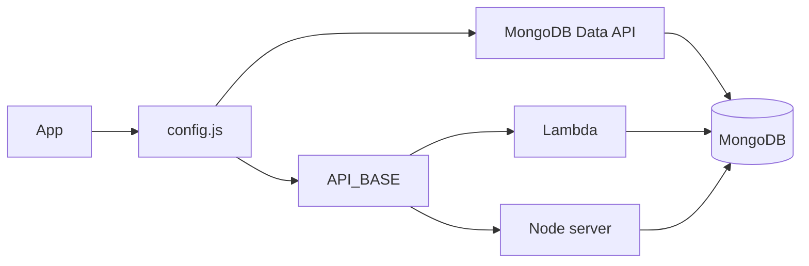
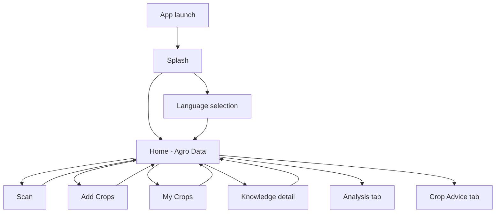

# KrishiRakshak

**Seeds to Market – Farming Companion**

KrishiRakshak is an agricultural support app for farmers. It helps with crop selection, product discovery (seeds, fertilizers, crop protection), scanning and analyzing inputs, expert advice, and knowledge on seeds, fertilizers, crop protection, and crop nutrition. The app works with a MongoDB-backed products API (Node server or AWS Lambda) or directly via MongoDB Atlas Data API.

---

## Table of contents

- [Features](#features)
- [Tech stack](#tech-stack)
- [Prerequisites](#prerequisites)
- [Project structure](#project-structure)
- [Installation and setup](#installation-and-setup)
- [Configuration (app)](#configuration-app)
- [Running the app](#running-the-app)
- [Backend options (products API)](#backend-options-products-api)
- [Database and category mapping](#database-and-category-mapping)
- [Scripts and tooling](#scripts-and-tooling)
- [App flow and navigation](#app-flow-and-navigation)
- [Building for production](#building-for-production)
- [Troubleshooting](#troubleshooting)
- [Related documentation](#related-documentation)
- [License and contributing](#license-and-contributing)

---

## Features

### Splash and onboarding

- **Splash screen:** Full-screen green branding with app name and “Seeds to Market” tagline; auto-advances after a short delay.
- **Language selection (first time only):** Six languages in a 2-column grid: Hindi, English, Bangla, Marathi, Odia, Gujarati. Selection is persisted with AsyncStorage (`hasSeenLanguageSelection`, `selectedLanguage`). Shown only on first launch.

### Home (Agro Data)

- **Location:** Displays current location; banner to request location permission; reverse geocoding via backend (if `GEOCODE_API_BASE` is set) or in-app Nominatim.
- **Search bar:** Placeholder for product/brand search (UI in place).
- **Crop strip:** “Add Crop” plus horizontally scrollable list of selected crops. Tapping “Add Crop” opens Add Crops; tapping a crop opens My Crops for that crop.
- **Scan to analyze:** Prominent card opening the Scan screen (camera/upload for seeds, fertilizers, pesticides).
- **Quick Access grid:** Four cards – Seeds, Fertilizers, Crop Protection, Crop Nutrition – each opening a dedicated knowledge detail page.

### Bottom navigation

- **Agro Data:** Home (crop strip, scan, Quick Access).
- **Analysis:** Dedicated analysis/history view.
- **Crop Advice:** Ask Agri Expert form (name, phone, village, topic, crop, question; submit and success state).

### My Crops / crop detail

- **Per-crop view:** For each selected crop, tabs/sections for Seeds, Fertilizers, and Insecticide details.
- **Product list:** Products grouped by brand; filtered by UI category (Seeds / Fertilizers / Crop Protection) using the same category mapping as the backend.
- **Product detail screen:** Full product info; optional crop enrichment.
- **Voice / chat:** When `CHAT_API_BASE` is set, Ask AI / chat in My Crops (POST `{ "query": "user message" }` to `/api/chat`).

### Scan

- **Camera or upload:** Capture or pick an image to analyze seeds, fertilizers, or pesticides.
- **Analysis results:** Display of scan outcome and confidence.
- **History:** Scan history persisted locally (see `src/utils/scanHistory.js`).

### Analysis

- **Analysis tab:** Dedicated screen for viewing analysis history/results from the bottom nav.

### Crop Advice (Ask Agri Expert)

- **Form:** Name (required), phone (required, 10 digits), village/location (optional), topic (Pest & Disease, Fertilizer, Irrigation, Market, Other), crop (optional), question (required).
- **Submit:** Sends request; shows success state with confirmation message.

### Knowledge pages

- **Detail screens:** Four topics opened from Quick Access – Seeds, Fertilizers, Crop Protection, Crop Nutrition. Rich content (sections and subsections) defined in `src/screens/KnowledgeDetailScreen.js`.

### Product filtering (category mapping)

- **Seeds:** Only products with `category_name: "Fruit Vegetable Crop"`.
- **Fertilizers:** Only `Water Sol Fertilizer`, `Bio-Fertilizers`, `Micronutrients`.
- **Insecticides / Pesticides (Crop Protection):** Only `Insecticide`, `Herbicide`, `Fungicide`, `Bio-stimulants`.

Mapping is centralized in `src/data/categoryMapping.js` and mirrored in `server/categoryMapping.js` and `lambda/categoryMapping.js`.

---

## Tech stack

- **Frontend:** React Native 0.83, React 19. React Native SVG, Safe Area Context, Permissions, Image Picker, Voice, React Native FS. No separate navigation library; screens are driven by state in `App.tsx` and `HomeScreen.js`.
- **Backend options:** (1) Node/Express server in `server/` (products + geocode), (2) AWS Lambda + API Gateway in `lambda/` (products), (3) MongoDB Atlas Data API (direct from app via `src/utils/mongodbDataApi.js`).
- **Data:** MongoDB (Atlas or local). Main collections: `fertilizers_data`, `brands`, `crops`, `categories`. See [src/MONGODB_STRUCTURE.md](src/MONGODB_STRUCTURE.md).
- **Tooling:** Node >= 20, npm, Metro, ESLint, Prettier, Jest. TypeScript for `App.tsx`. Sharp (devDependency) for icon generation (`generate-icons.js`).

---

## Prerequisites

- **Node.js** >= 20 (see `engines` in `package.json`).
- **Android:** JDK 17+, Android SDK, Android Studio or CLI; device or emulator for running the app.
- **iOS:** Xcode, CocoaPods. From project root: `bundle install` then `bundle exec pod install`.
- **Optional:** AWS CLI and SAM CLI for Lambda deploy; MongoDB (local or Atlas) for products and optional geocode server.

---

## Project structure

```
KrishiRakshak/
├── App.tsx                 # Root: splash → language → HomeScreen
├── index.js                # RN entry
├── package.json
├── .env.example            # Template for server .env (not used by app directly)
├── generate-icons.js       # Generate app icons from assets/logo.svg
├── src/
│   ├── config.js           # API_BASE, MONGODB_DATA_API_*, GEOCODE_API_BASE, CHAT_API_BASE
│   ├── screens/            # SplashScreen, LanguageSelection, HomeScreen, ScanScreen,
│   │                       # AnalysisScreen, AddCropsScreen, MyCropsScreen, CropProductsScreen,
│   │                       # ProductDetailScreen, AskAgriExpertScreen, KnowledgeDetailScreen
│   ├── components/         # Icons, CropIcons, Logo, WaveShape, DesignHero, etc.
│   ├── data/               # categoryMapping, cropsByCategory
│   ├── utils/              # productsApi, mongodbDataApi, scanHistory, cropImageCache
│   └── MONGODB_STRUCTURE.md
├── server/                 # Node app: /api/products, /reverse-geocode
│   ├── index.js
│   ├── routes/products.js
│   ├── db.js
│   └── categoryMapping.js
├── lambda/                 # SAM app for products API on AWS
│   ├── template.yaml
│   ├── handlers.js
│   ├── categoryMapping.js
│   └── README.md
├── android/                # RN Android project
├── ios/                    # RN iOS project
├── assets/                 # logo.svg, design/, images
├── scripts/                # e.g. downloadCropImages.js
├── APP_SCREENS.md          # Screen-by-screen flow and UI notes
└── README.md               # This file
```

For detailed screen flows see [APP_SCREENS.md](APP_SCREENS.md). For database schemas see [src/MONGODB_STRUCTURE.md](src/MONGODB_STRUCTURE.md).

---

## Installation and setup

1. **Clone the repository**
   ```bash
   git clone <repo-url>
   cd KrishiRakshak
   ```

2. **Install dependencies**
   ```bash
   npm install
   ```

3. **iOS only – install CocoaPods and pods**
   ```bash
   bundle install
   bundle exec pod install
   ```

4. **Server .env (optional, for Node backend)**  
   Copy `.env.example` to `.env` in the project root and set:
   - `MONGODB_URI` – MongoDB connection string (local or Atlas).
   - `MONGODB_DB` – Database name (e.g. `krishi-rakshak`).
   - `PORT` – Server port (default `3000`).
   - Optionally `GEOCODER_EMAIL` for Nominatim usage policy.

   The **app** does not read `.env`; it uses `src/config.js` (see [Configuration (app)](#configuration-app)).

---

## Configuration (app)

All app-side configuration is in [src/config.js](src/config.js).

| Variable | Purpose | Example values |
|--------|----------|----------------|
| `API_BASE` | Products API root (no trailing slash). Used when MongoDB Data API is not configured. | Lambda: `https://xxx.execute-api.ap-south-1.amazonaws.com`<br>Android emulator: `http://10.0.2.2:3000`<br>iOS simulator: `http://localhost:3000`<br>Physical device: `http://<your-machine-ip>:3000` |
| `MONGODB_DATA_API_APP_ID` | Atlas Data API App ID. If set with `MONGODB_DATA_API_KEY`, product fetches use Data API and bypass `API_BASE` for products. | From Atlas App Services → Data API |
| `MONGODB_DATA_API_KEY` | Atlas Data API key. | From Atlas App Services → API Keys |
| `MONGODB_DATABASE` | Database name for Data API. | `krishi-sakhi` |
| `MONGODB_DATA_SOURCE` | Data source name in Atlas App (often `mongodb-atlas`). | `mongodb-atlas` |
| `GEOCODE_API_BASE` | Reverse geocode backend URL. If set, location uses this (e.g. Node server `/reverse-geocode`); otherwise in-app Nominatim. | Same as `API_BASE` when using Node server; or `null` |
| `CHAT_API_BASE` | Optional Ask AI / chat backend. My Crops sends POST to `CHAT_API_BASE/api/chat` with `{ "query": "..." }`. | e.g. ngrok URL or your backend |

---

## Running the app

1. **Start Metro**
   ```bash
   npm start
   ```

2. **Run on device/emulator**
   - **Android:** `npm run android` (or run from Android Studio).
   - **iOS:** `npm run ios` (or run from Xcode; use the `.xcworkspace`).

3. **Dev menu and reload**
   - **Android:** Ctrl+M (Windows/Linux) or Cmd+M (macOS).
   - **iOS:** Cmd+D in simulator, or Device menu.
   - **Reload:** Press R twice in the app or simulator.

4. **Optional – Node server (products + geocode)**  
   In a separate terminal:
   ```bash
   npm run server
   ```
   Uses `.env` (MONGODB_URI, PORT). Set `API_BASE` and optionally `GEOCODE_API_BASE` in `src/config.js` to point to this server (see table above).

---

## Backend options (products API)

The app can get product data in three ways.

### 1. Node server

- Run: `npm run server`.
- Set `API_BASE` in `src/config.js` to `http://10.0.2.2:3000` (Android emulator) or `http://localhost:3000` (iOS simulator) or `http://<machine-ip>:3000` (physical device).
- Endpoints:  
  - `GET /api/products/debug`  
  - `GET /api/products/by-crop-category?cropName=Wheat&uiCategory=seeds|fertilizers|insecticide`  
  - `GET /api/products/:productId?enrich=crops`  
- Category mapping: `server/categoryMapping.js` (same logic as app).

### 2. AWS Lambda

- Deploy from `lambda/` following [lambda/README.md](lambda/README.md) (SAM, MongoUri parameter).
- Set `API_BASE` in `src/config.js` to the deployed API Gateway URL (no trailing slash).

### 3. MongoDB Data API

- In Atlas: App Services → Data API → enable; create API key and copy App ID and key.
- Set `MONGODB_DATA_API_APP_ID` and `MONGODB_DATA_API_KEY` in `src/config.js`. Optionally set `MONGODB_DATABASE` and `MONGODB_DATA_SOURCE`.
- Product fetching uses `src/utils/mongodbDataApi.js` and does not use `API_BASE` for those calls.



---

## Database and category mapping

### Collections

See [src/MONGODB_STRUCTURE.md](src/MONGODB_STRUCTURE.md) for full schemas and indexes. Main collections:

- **fertilizers_data** – Products (product_id, product_name, category_name, brand_name, target_crops, etc.).
- **brands** – Brand metadata and images.
- **crops** – Crop list and images.
- **categories** – Category names and counts.

### UI category mapping

The app exposes three UI categories; each maps to one or more `category_name` values in the database.

| UI category | `category_name` values (DB) |
|-------------|-----------------------------|
| **Seeds** | `Fruit Vegetable Crop` |
| **Fertilizers** | `Water Sol Fertilizer`, `Bio-Fertilizers`, `Micronutrients` |
| **Crop Protection (Insecticide details)** | `Insecticide`, `Herbicide`, `Fungicide`, `Bio-stimulants` |

Defined in:

- [src/data/categoryMapping.js](src/data/categoryMapping.js) (app)
- [server/categoryMapping.js](server/categoryMapping.js) (Node server)
- [lambda/categoryMapping.js](lambda/categoryMapping.js) (Lambda)

---

## Scripts and tooling

### npm scripts (package.json)

| Script | Command | Description |
|--------|---------|-------------|
| `start` | `react-native start` | Start Metro bundler |
| `android` | `react-native run-android` | Build and run on Android |
| `ios` | `react-native run-ios` | Build and run on iOS |
| `lint` | `eslint .` | Run ESLint |
| `test` | `jest` | Run tests |
| `server` | `node server/index.js` | Start Node products + geocode server |

### Icon generation

```bash
node generate-icons.js
```

- Reads [assets/logo.svg](assets/logo.svg).
- Generates:
  - Android: mipmap icons (mdpi–xxxhdpi) and `drawable-xxxhdpi/ic_launcher_foreground.png`.
  - iOS: all sizes in `ios/.../AppIcon.appiconset/`.
  - Design: `assets/design/icon_48.png` through `icon_1024.png`.
- Requires **sharp** (already in devDependencies).

### Lambda deploy

From `lambda/` directory: install deps, `sam build`, `sam deploy` (see [lambda/README.md](lambda/README.md)). Pass MongoDB URI as `MongoUri` parameter.

### Other scripts

- [scripts/downloadCropImages.js](scripts/downloadCropImages.js) – Downloads crop images for local/cache use.

---

## App flow and navigation

- **Launch:** App starts in Splash. After delay, if first time → Language Selection; else → Home.
- **Home:** Agro Data tab. From here the user can open Scan (full-screen), Add Crops, My Crops (by crop), Quick Access knowledge pages (Seeds / Fertilizers / Crop Protection / Crop Nutrition), or switch tabs to Analysis or Crop Advice (Ask Agri Expert).
- **Navigation:** Implemented with React state in `App.tsx` and `HomeScreen.js` (e.g. `showScanScreen`, `showAddCropsScreen`, `activeTab`, `showKnowledgeScreen`, `knowledgeTopic`). No React Navigation (or similar) library.



---

## Building for production

### Android

- Release build: e.g. `cd android && ./gradlew assembleRelease`. Output: `android/app/build/outputs/apk/release/app-release.apk`.
- Signing: Configure `signingConfigs` in `android/app/build.gradle` and use a release keystore. Do not commit keystore or passwords.

### iOS

- Open `ios/KrishiRakshak.xcworkspace` in Xcode. Select a device or “Any iOS Device”, then Product → Archive. Configure signing and provisioning per Apple’s docs for distribution.

### Environment

- For production builds, set `API_BASE` (or MongoDB Data API credentials) and, if used, `CHAT_API_BASE` and `GEOCODE_API_BASE` in `src/config.js` to production endpoints. Do not commit secrets; use build-time config or a secure config service if needed.

---

## Troubleshooting

| Issue | What to try |
|-------|-------------|
| **Metro won’t connect / bundle fails** | Ensure port 8081 is free. Run `npm start -- --reset-cache`. |
| **Android: device/emulator not found** | Check `adb devices`. Set `ANDROID_HOME` and run Android Studio once to accept SDK licenses. |
| **iOS: build or pod errors** | Run `bundle exec pod install` from project root. Open `.xcworkspace`, not `.xcodeproj`. |
| **Products list empty / “not connected”** | If using Node server: ensure `npm run server` is running and `API_BASE` points to it (use device IP for physical device). If using Lambda: confirm MongoUri was passed at deploy and `API_BASE` is the API Gateway URL. If using Data API: check `MONGODB_DATA_API_APP_ID` and `MONGODB_DATA_API_KEY` in `src/config.js`. |
| **Geocoding fails** | If using backend geocode: set `GEOCODE_API_BASE` and run the Node server. If using in-app Nominatim: be aware of rate limits; optional `GEOCODER_EMAIL` in server `.env` for Nominatim policy. |

---

## Related documentation

- [APP_SCREENS.md](APP_SCREENS.md) – Screen-by-screen flow and UI notes.
- [src/MONGODB_STRUCTURE.md](src/MONGODB_STRUCTURE.md) – MongoDB collections, schemas, indexes.
- [lambda/README.md](lambda/README.md) – SAM deploy and Lambda product API endpoints.

---

## License and contributing

- **License:** Proprietary – Hackathon (or set as appropriate for your use).
- **Contributing:** Before submitting changes, run `npm run lint` and `npm test`. Use a feature branch and keep the README and config docs in sync with any new backend or app options.
